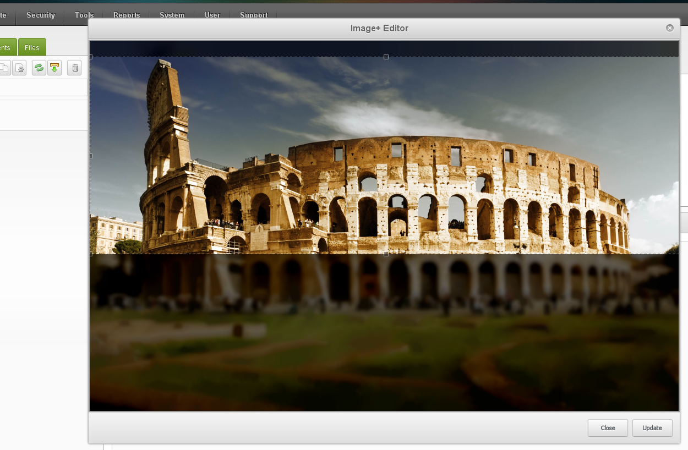

Image+ is an extension for MODX Revolution that enables image cropping and advanced
options for images used in Template Variables (TVs).

An new <abbr title="Template Variable">TV</abbr> type gives developers the power to forcibly control
the size and ratio of user uploaded images. Once size constraints are set, users
are prompted to crop their selected image using a GUI cropping tool in the browser,
and optionally set an alt-tag or title for the image.

    
    
    
    

### Requirements
-------------------------------
* MODX Revolution 2.2.4+
* Either
     [phpThumbOf](http://modx.com/extras/package/phpthumbof)
  or
     [phpThumbsUp](http://modx.com/extras/package/phpthumbsup)
  MODX components

### Features
-------------------------------
* Visual Image cropping tool integrated into the MODX manager interface
* Option to constrain one or both width & height of the output image
* User image crop can be forced to remain at pre-set ratio
* Use a chunk as an output template to get placeholders for url, height, width & alt-tag
* De-coupled image cropping classes, to be flexible about which image manipulation package
  to use

### Authors
-------------------------------
This component was started and is currently maintained by @alanpich.

#### Other contributors
* @thomasd
* @em-piguet
* @tillilab
* @FlyGenring
* @kristofkotai
* @Alroniks
* @rtripault
* @TheBoxer
* @KristianP
* @silentworks